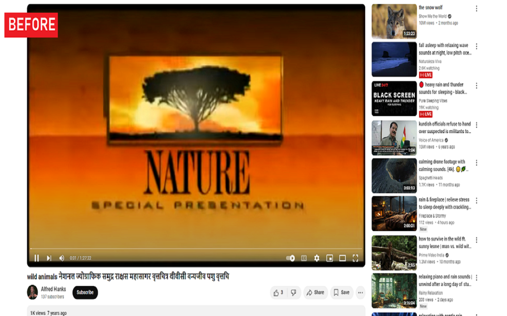
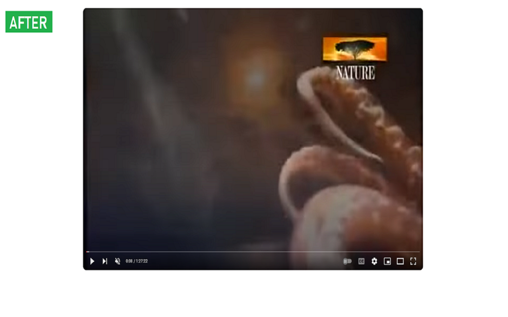

#  YouTube Cleanup README

"YouTube Cleanup" is a browser extension designed to help you focus entirely on YouTube videos by hiding distracting comments and recommendations. This improves your overall viewing experience, allowing you to concentrate on the content. The extension provides a simple toggle functionality to enable or disable these features at any time.

 

## Installation
Install the extension from https://chromewebstore.google.com/detail/youtube-cleanup/abkpopglajccpoakhifodgpnoomkadeo

## Requirements
- Chrome based browser.

## Known Issues
Recommendations section cannot be recovered with the toggle in some occasions. Please report any issues you find on the GitHub repository.

## Release Notes

### 1.0.0

- Initial release of "YouTube Cleanup" chrome extension. Includes functionality to hide comments and recommendations, with a toggle to enable or disable these features.

---